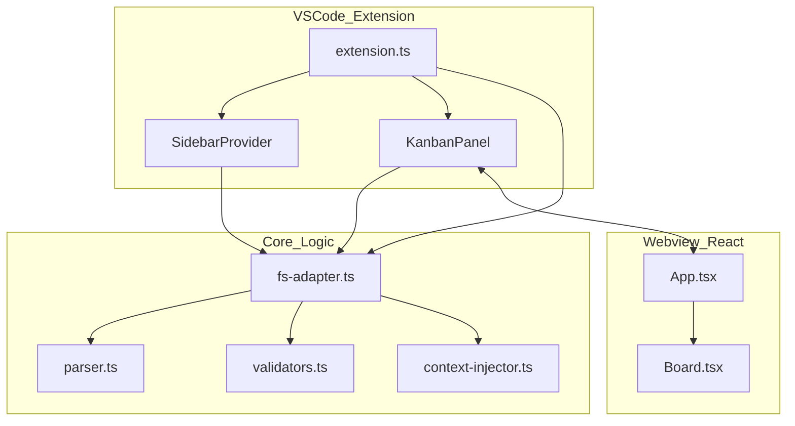

# Architecture Documentation

## Project Overview
KanbanLLM is a VSCode extension that provides a file-based Kanban board for managing tasks, specifically designed for LLM-assisted development. It uses Markdown files with YAML frontmatter to store tasks and phases, allowing for a seamless workflow where project management lives alongside the code.

## Completed Features
(Based on `roadmapcompleted.md` status)

### Core Backend (`src/core`)
- **File System Operations**: Robust handling of file reads, writes, moves, and deletes.
- **Markdown Parsing**: Custom parser using `gray-matter` to separate frontmatter, managed context, and user content.
- **Validation**: Zod-based validation for data integrity (IDs, stages, types).
- **Context Injection**: System to inject and update stage/phase context into task files.
- **ID Generation**: Unique ID generation for phases and tasks.

### VSCode Extension (`vscode-extension`)
- **Webview Board**: React-based Kanban board with drag-and-drop support (`@dnd-kit`).
- **Sidebar View**: Tree view integration for quick access to tasks.
- **Command Palette**: Full suite of commands (Create Task, Move Task, Copy with Context, etc.).
- **File Watcher**: Real-time updates when files change on disk.
- **Search & Filter**: Client-side filtering by tag and phase.

## File Tree & Descriptions

### Core Logic (`src/core/`)
This directory contains the shared business logic used by the extension.
- **`fs-adapter.ts`**: The primary interface for file system interactions. It handles listing items, reading/writing files, moving items between stages, and deleting items. It ensures atomic operations and path security.
- **`parser.ts`**: Responsible for parsing raw Markdown content into structured `Item` objects and serializing `Item` objects back to Markdown. It handles the separation of YAML frontmatter, managed context sections, and user content.
- **`validators.ts`**: Contains Zod schemas and validation functions. It ensures that frontmatter data (IDs, titles, stages) and filenames adhere to the strict format required by the system.
- **`context-injector.ts`**: Manages the "managed" section of the Markdown files. It injects context based on the current stage and phase, ensuring that tasks have relevant context for LLMs.
- **`types.ts`**: Defines the shared TypeScript interfaces (`Item`, `Frontmatter`, `Stage`, etc.) used across the backend and frontend.

### VSCode Extension (`vscode-extension/src/`)
This directory contains the VSCode-specific implementation.
- **`extension.ts`**: The main entry point. It activates the extension, registers commands (e.g., `llmKanban.createTask`), sets up the file watcher, and initializes the sidebar and webview providers.
- **`sidebar/SidebarProvider.ts`**: Implements the `vscode.TreeDataProvider` interface. It fetches data (via `fs-adapter`) to populate the "LLM Kanban" sidebar view.
- **`webview/KanbanPanel.ts`**: Manages the lifecycle of the Webview panel. It handles creating the panel, setting up the HTML content, and managing message passing between the extension process and the React webview.

### Webview Frontend (`vscode-extension/webview-src/`)
This directory contains the React application that runs inside the Webview.
- **`index.tsx`**: The entry point for the React application.
- **`App.tsx`**: The root component. It manages the local state of the board, handles search/filter logic, and coordinates drag-and-drop events.
- **`components/Board.tsx`**: Renders the Kanban columns and handles the drag-and-drop context.
- **`components/Column.tsx`**: Renders a single stage column (e.g., "Planning", "Coding").
- **`components/Card.tsx`**: Renders an individual task or phase card.
- **`types.ts`**: Frontend-specific type definitions (mirroring core types where necessary).

## File Relationships & Dependencies

### 1. Extension Initialization & Command Flow
- **`extension.ts`** is the central hub.
    - It imports **`SidebarProvider`** to register the tree view.
    - It imports **`KanbanPanel`** to handle the "Open Board" command.
    - It imports **`fs-adapter`** functions (like `createItem`, `moveItem`) to execute commands triggered from the Command Palette.

### 2. Data Loading & Management
- **`SidebarProvider`** -> calls **`fs-adapter.loadAllItems()`**.
- **`KanbanPanel`** -> receives messages from the webview -> calls **`fs-adapter`** functions.
- **`fs-adapter.ts`** relies on:
    - **`parser.ts`**: To convert file content to objects.
    - **`validators.ts`**: To ensure data validity before writing.
    - **`context-injector.ts`**: To update the managed section when items are created or moved.

### 3. Webview Communication
- **`App.tsx`** (Frontend) <-> **`KanbanPanel.ts`** (Extension)
    - The frontend sends messages (e.g., `moveItem`, `openFile`) to the extension.
    - The extension processes these requests (often using `fs-adapter`) and sends back updates (e.g., `updateItems`).

### 4. Core Dependencies
- **`fs-adapter.ts`** is the main consumer of the other core modules.
- **`context-injector.ts`** uses **`parser.ts`** helpers to manipulate markdown structure.
- **`validators.ts`** is a standalone utility module used by `fs-adapter` and `parser`.

## Diagram: High-Level Architecture

## Build & Sync Notes (for future agents)
- Always rebuild the extension before testing UI changes: `cd vscode-extension && bun run compile`.
- The compiler outputs to `vscode-extension/out/src/*` while VS Code loads from `vscode-extension/out/*`. After compiling, copy the fresh artifacts into place (e.g., `cp -a out/src/. out/`) so the webview uses the latest `KanbanPanel` instead of the old placeholder.
- If the board shows the “coming soon” placeholder, it means the compiled `out/webview/KanbanPanel.js` is stale—rerun the compile + copy sync above to fix it.
