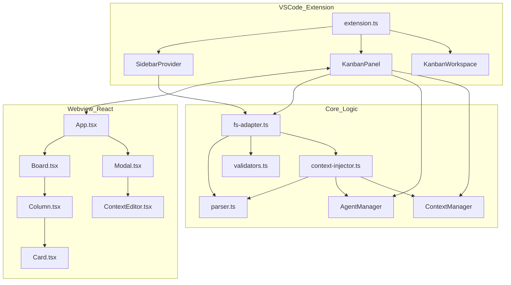

# Architecture Documentation

## Project Overview
KanbanLLM is a VSCode extension that provides a file-based Kanban board for managing tasks and phases, specifically designed for LLM-assisted development workflows. It uses Markdown files with YAML frontmatter to store items, with integrated agent and context management for AI-powered development.

**Current Version**: 0.1.0 (Phase 2 Complete + Backend Enhancements)

## Completed Features

### Phase 1 (Baseline)
- File-based Kanban board with drag-and-drop
- Command palette integration
- Sidebar tree view
- Basic CRUD operations
- Search and filter

### Phase 2 (M0-M8 Complete)
- **Stage Alignment**: Canonical stage vocabulary (`chat`, `queue`, `plan`, `code`, `audit`, `completed`)
- **File Naming**: Stage-prefixed filenames (`{stage}.{id}.md`)
- **Agent System**: Agent definitions with model/temperature config
- **Context Management**: Stage, phase, agent, and custom contexts
- **Context Discovery**: `listContexts()` with metadata (name, type, size, path)
- **Monaco Editor**: In-app editing of contexts and agents
- **Premium UI**: Glassmorphism design with smooth animations
- **Enhanced Copy**: Copy with full context assembly
- **Migration Tools**: Workspace migration command
- **Token Utilities**: Context size estimation and validation

## File Tree & Descriptions

### Core Logic (`src/core/`)
Business logic shared across the extension.

#### **`fs-adapter.ts`**
Primary file system interface. Handles:
- Item CRUD (create, read, update, delete)
- Stage transitions with context reinjection
- Context file management (read/write)
- **Context discovery** (`listContexts()` - NEW)
- Migration utilities (`migrateToCanonicalFilenames`)
- Flattening items for webview (`FlatItem` interface)

**Key Functions**:
- `loadBoardData()` - Loads all items grouped by stage
- `readItemById()` - Finds and reads item across stages
- `createItem()` - Creates new item with context injection
- `moveItemToStage()` - Moves item and reinjects context
- `updateItem()` - Updates frontmatter only
- `readContextFile()` / `writeContextFile()` - Context management
- **`listContexts()` - Lists all contexts with metadata (NEW)**
- `migrateToCanonicalFilenames()` - Renames legacy files

**New Types**:
- `ContextMetadata` - Context metadata (id, name, type, path, size)

#### **`parser.ts`**
Markdown parsing and serialization.

**Key Functions**:
- `parseItem()` - Parses markdown to `Item` object
- `serializeItem()` - Converts `Item` to markdown
- `extractUserContent()` - Extracts user section
- `buildManagedSection()` - Builds context section with stage/phase/agent/contexts

**Schemas**:
- `FrontmatterSchema` - Validates item frontmatter
- `AgentFrontmatterSchema` - Validates agent frontmatter

#### **`validators.ts`**
Zod-based validation schemas.

**Schemas**:
- `CreateItemSchema` - Validates item creation data
- `UpdateItemSchema` - Validates item updates
- `MoveItemSchema` - Validates stage moves

#### **`context-injector.ts`**
Manages the "managed" section of markdown files.

**Key Functions**:
- `injectContext()` - Injects context into new items
- `reinjectContextForStageChange()` - Updates context on stage change
- `createItemWithContext()` - Creates item with full context
- `updateFrontmatterOnly()` - Updates metadata without touching content
- `resolveAgentAndContexts()` - Resolves agent and context content

#### **`AgentManager.ts`**
Manages agent definitions.

**Methods**:
- `getAgent(id)` - Retrieves agent by ID
- `listAgents()` - Lists all available agents

**Agent Structure**:
```typescript
interface Agent {
  id: string;
  name: string;
  description?: string;
  systemPrompt: string;
  config?: {
    model?: string;
    temperature?: number;
  };
}
```

#### **`ContextManager.ts`**
Resolves context content.

**Methods**:
- `resolveContext(type, id)` - Reads context file content

**Context Types**: `stage`, `phase`, `agent`, `context`

#### **`LLMClient.ts`**
LLM provider abstraction (currently mock implementation).

#### **`token-utils.ts`** ⭐ NEW
Token counting and context size utilities.

**Functions**:
- `estimateTokenCount(text)` - Simple token estimation (~1 token per 4 chars)
- `estimateTokenCountAdvanced(text)` - Advanced estimation with code/special char accounting
- `formatBytes(bytes)` - Human-readable byte formatting
- `checkContextSize(text)` - Validates context size with warnings

**Returns**:
- Character count
- Word count
- Estimated token count
- Size warnings for large contexts

#### **`types.ts`**
Shared TypeScript interfaces.

**Key Types**:
- `Item` - Core item structure
- `Frontmatter` - Item metadata
- `Stage` - Stage enum
- `FlatItem` - Flattened item for webview

### VSCode Extension (`src/`)

#### **`extension.ts`**
Main entry point. Registers commands and providers.

**Commands**:
- `llmKanban.openBoard` - Opens Kanban webview
- `llmKanban.initializeWorkspace` - Scaffolds workspace
- `llmKanban.createTask` / `createPhase` - Creates items
- `llmKanban.moveTask` - Moves item between stages
- `llmKanban.copyWithContext` - Copies with context
- `llmKanban.deleteItem` - Deletes item
- `llmKanban.migrateWorkspace` - Migrates to canonical filenames
- `llmKanban.refreshSidebar` - Refreshes tree view

#### **`sidebar/SidebarProvider.ts`**
Implements `TreeDataProvider` for sidebar.

**Methods**:
- `getTreeItem()` - Returns tree item
- `getChildren()` - Returns child items
- `refresh()` - Refreshes tree

#### **`webview/KanbanPanel.ts`**
Manages webview lifecycle and message passing.

**Message Handlers**:
- `moveItem` - Moves item between stages
- `openItem` - Opens item in editor
- `deleteItem` - Deletes item
- `copyWithContext` - Copies item content
- `updateItem` - Updates item frontmatter
- `createTask` / `createPhase` - Creates new items
- `getAgent` / `listAgents` - Agent operations
- **`listContexts` - Lists all contexts with metadata (NEW)**
- `getContext` / `saveContext` - Context operations

**Key Methods**:
- `createOrShow()` - Creates or reveals panel
- `_handleMessage()` - Routes webview messages
- `_loadBoardData()` - Loads and sends board data
- `_copyWithContext()` - Assembles and copies content

#### **`workspace/KanbanWorkspace.ts`**
Workspace initialization and structure.

**Functions**:
- `ensureKanbanWorkspace()` - Creates `.llmkanban/` structure
- `isKanbanWorkspaceInitialized()` - Checks initialization
- `bindKanbanRoot()` - Configures workspace root

**Directory Structure**:
```
.llmkanban/
├── chat/
├── queue/
├── plan/
├── code/
├── audit/
├── completed/
└── _context/
    ├── stages/
    ├── phases/
    ├── agents/
    └── [custom contexts]
```

### Webview Frontend (`webview-src/`)

#### **`index.tsx`**
React app entry point.

#### **`App.tsx`**
Root component. Manages board state and message passing.

**State**:
- `boardData` - Items grouped by stage
- `activeContext` - Currently editing context
- `agents` - Available agents
- `contexts` - Available contexts (Phase 1)
- `isTaskFormOpen` - Task form modal state (Phase 1)
- `error` - Error state for ErrorPopup (Phase 1)
- Search/filter state

**Message Handling**:
- Sends messages to extension via `vscode.postMessage()`
- Receives updates via `window.addEventListener('message')`

**Keyboard Shortcuts** (Phase 1):
- `Ctrl+Shift+N` / `Cmd+Shift+N` - Open task creation form

**Features** (Phase 1):
- Integrated TaskForm for creating tasks/phases
- Error handling with ErrorPopup
- Auto-fetch agents and contexts on load

#### **`components/Board.tsx`**
Renders Kanban columns with horizontal scrolling.

**Props**:
- `data` - Board data
- `onMoveItem` - Move handler
- `onOpenItem` - Open handler
- `onDeleteItem` - Delete handler
- `onCopy` - Copy handler
- `onUpdate` - Update handler
- `onContextClick` - Context click handler

#### **`components/Column.tsx`**
Renders single stage column with drag-and-drop.

**Features**:
- Glassmorphic header
- Item count badge
- Drop zone highlighting

#### **`components/Card.tsx`**
Renders individual item card.

**Features**:
- Inline title editing (double-click)
- Delete confirmation
- Agent/context tags (clickable)
- Copy button with modes
- Hover effects

#### **`components/ui/Button.tsx`**
Reusable button component.

**Variants**: `primary`, `secondary`, `destructive`, `ghost`, `icon`

#### **`components/ui/Modal.tsx`**
Reusable modal component.

**Features**:
- Glassmorphism backdrop
- Keyboard shortcuts (Escape to close)
- Click-outside to close

#### **`components/ContextEditor.tsx`**
Monaco editor wrapper for contexts.

**Features**:
- Markdown syntax highlighting
- Dirty state tracking
- Save/cancel actions
- Loading state

#### **`components/TaskForm.tsx`** ⭐ NEW (Phase 1)
Comprehensive task/phase creation form.

**Features**:
- All fields: title, type, stage, phase, agent, contexts, tags, content
- Form validation (required fields)
- Integrated ContextSelector and AgentDropdown
- Inline tag editor (add/remove)
- Submit error handling
- Loading states

**Props**:
- `isOpen` - Modal visibility
- `onClose` - Close handler
- `onSubmit` - Form submission handler
- `agents` - Available agents
- `contexts` - Available contexts
- `phases` - Available phases

#### **`components/ContextSelector.tsx`** ⭐ NEW (Phase 1)
Multi-select context picker with search and grouping.

**Features**:
- Search/filter by name or ID
- Grouped by type (Stages, Phases, Agents, Custom)
- Collapsible groups
- Selected count badge
- File size metadata display
- Custom checkboxes with liquid glass styling

**Props**:
- `contexts` - Available contexts
- `selectedIds` - Currently selected context IDs
- `onChange` - Selection change handler

#### **`components/AgentDropdown.tsx`** ⭐ NEW (Phase 1)
Rich agent selection dropdown with search.

**Features**:
- Custom trigger with selected agent display
- Search/filter agents
- Agent metadata (model, temperature, description)
- "None" option to unassign
- Visual selection indicators
- Backdrop click-to-close

**Props**:
- `agents` - Available agents
- `selectedId` - Currently selected agent ID
- `onChange` - Selection change handler

#### **`components/ErrorPopup.tsx`** ⭐ NEW (Phase 1)
Error display modal with expandable details.

**Features**:
- Error message display
- Expandable error details (stack traces, etc.)
- Optional retry button
- Close button
- Liquid glass styling

**Props**:
- `message` - Error message
- `details` - Optional error details
- `onClose` - Close handler
- `onRetry` - Optional retry handler

#### **`components/Toast.tsx`** ⭐ NEW (Phase 2)
Toast notification system with auto-dismiss.

**Features**:
- Success, Info, Warning types
- Auto-dismiss (3.5s default)
- Manual dismiss button
- Slide-in animation from right
- Bottom-right positioning
- Stacked display for multiple toasts

**Exports**:
- `ToastContainer` - Renders all active toasts
- `useToast` - Hook for managing toast state

**Hook API**:
```typescript
const { toasts, showToast, dismissToast } = useToast();
showToast({ type: 'success', title: 'Item created', message: 'Task title' });
```

#### **`components/SkeletonCard.tsx`** ⭐ NEW (Phase 2)
Loading placeholder cards with shimmer effect.

**Features**:
- Shimmer animation (2s infinite)
- Matches real card dimensions
- Liquid glass styling
- Configurable count

**Exports**:
- `SkeletonCard` - Single skeleton card
- `SkeletonCards` - Multiple skeleton cards

**Props**:
- `count` - Number of skeleton cards to render (default: 3)

#### **`styles/board.css`**
Design system with CSS variables.

**Features**:
- Glassmorphism/liquid glass effects
- Color palette (dark mode)
- Utility classes
- Animations
- Form styles (Phase 1)
- Component-specific styles (ContextSelector, AgentDropdown, ErrorPopup)

#### **`types.ts`**
Frontend type definitions.

**Key Types**:
- `BoardData` - Items grouped by stage
- `WebviewMessage` - Messages to extension
- `ExtensionMessage` - Messages from extension
- `Agent` - Agent interface

## File Relationships & Data Flow

### 1. Extension Initialization
```
extension.ts
├── Registers commands
├── Creates SidebarProvider
├── Creates KanbanPanel
└── Sets up file watcher
```

### 2. Data Loading
```
SidebarProvider → fs-adapter.loadAllItems()
KanbanPanel → fs-adapter.loadBoardData() → Webview
```

### 3. Item Creation Flow
```
Webview (createTask) 
  → KanbanPanel (message handler)
  → fs-adapter.createItem()
  → context-injector.createItemWithContext()
  → AgentManager/ContextManager (resolve content)
  → parser.buildManagedSection()
  → parser.serializeItem()
  → Write file
```

### 4. Context Editing Flow
```
Webview (click context tag)
  → Send getContext message
  → KanbanPanel handler
  → fs-adapter.readContextFile()
  → Send contextData back
  → Modal opens with ContextEditor
  → User edits and saves
  → Send saveContext message
  → fs-adapter.writeContextFile()
```

### 5. Stage Move Flow
```
Webview (drag & drop)
  → Send moveItem message
  → KanbanPanel handler
  → fs-adapter.moveItemToStage()
  → context-injector.reinjectContextForStageChange()
  → Update managed section
  → Move file with new filename
  → Refresh webview
```

## Architecture Diagram



## Data Model

### Item Structure
```markdown
---
id: task-123
title: Implement feature
stage: code
type: task
agent: coder
contexts: [api-spec, database-schema]
phase: phase1-auth
tags: [backend, api]
created: 2025-01-01T00:00:00Z
updated: 2025-01-02T00:00:00Z
---

<!-- LLMKANBAN:MANAGED - Do not edit above this line -->
## 🎯 Stage: Code
[Stage context content...]

## 📦 Phase: Authentication
[Phase context content...]

## 🤖 Agent: Coder
[Agent system prompt...]

## 📚 Contexts
### API Specification
[Context content...]

<!-- LLMKANBAN:USER-CONTENT - Edit below this line -->
# Implementation Notes
[User content...]
```

### File Naming Convention
- **Tasks**: `{stage}.{id}.md` (e.g., `code.task-123.md`)
- **Phases**: `{stage}.{id}.md` (e.g., `plan.phase1-auth.md`)
- **Contexts**: `_context/{type}/{id}.md`

## Testing

**Test Framework**: Jest  
**Test Location**: `src/core/__tests__/`  
**Coverage**: 60 tests across 9 suites

### Test Suites

#### **`fs-adapter.test.ts`**
Tests file system operations:
- Item CRUD
- Stage transitions
- Context file management
- Filename migration

#### **`parser.test.ts`**
Tests markdown parsing:
- Frontmatter extraction
- Content serialization
- User content extraction
- Managed section building

#### **`validators.test.ts`**
Tests Zod schemas:
- Item creation validation
- Item update validation
- Stage move validation

#### **`normalization.test.ts`**
Tests stage normalization:
- Legacy stage mapping
- Canonical stage enforcement

#### **`AgentManager.test.ts`**
Tests agent management:
- Agent listing
- Agent retrieval
- Frontmatter parsing

#### **`ContextManager.test.ts`**
Tests context resolution:
- Context file reading
- Type-based path resolution

#### **`migration.test.ts`**
Tests workspace migration:
- Filename canonicalization
- Legacy format handling

#### **`listContexts.test.ts`** ⭐ NEW
Tests context discovery:
- Metadata extraction
- H1 heading parsing
- Multi-type scanning
- Empty directory handling

#### **`token-utils.test.ts`** ⭐ NEW
Tests token counting:
- Simple estimation
- Advanced estimation with code/special chars
- Byte formatting
- Context size validation

### Running Tests
```bash
npm test                 # Run all tests
npm test -- --watch      # Watch mode
npm test -- --coverage   # With coverage
```

## Build & Development

### Compilation
```bash
npm run compile
```

Outputs to `out/src/` and bundles webview to `out/webview.js`.

### Development Workflow
1. Make changes to TypeScript/React files
2. Run `npm run compile`
3. Reload VSCode window (`Developer: Reload Window`)
4. Test changes

### Packaging
```bash
npm run package
```

Creates `.vsix` file for distribution.

## Migration Notes

### From Legacy Format
Run `LLM Kanban: Migrate Workspace` command to:
- Rename files to canonical format (`{stage}.{id}.md`)
- Preserve all frontmatter and content
- Update file paths atomically

### Backward Compatibility
- Reads from legacy folders (`1-queue`, `planning`, etc.)
- Writes to canonical folders (`queue`, `plan`, etc.)
- Supports old filename format during transition

## Future Enhancements
- Real LLM integration (replace `MockLLMClient`)
- Automated task generation from contexts
- Collaboration features
- Advanced analytics
- Custom themes
